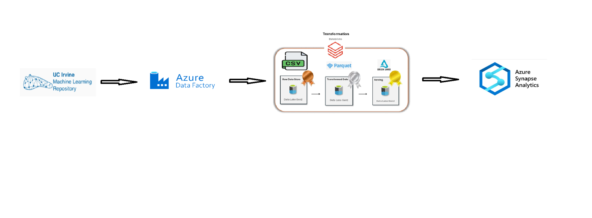

# Azure Online-Retail_Data_Engineering-Project

## Overview

This documentation provides a professional overview of an end-to-end Azure data engineering project. The solution uses **Azure Data Factory (ADF)** to ingest data from an Excel workbook into **Azure Data Lake Storage Gen2 (ADLS Gen2)** as CSV (Bronze layer). **Azure Databricks** then transforms the data into **Delta** format in Silver/Gold layers following the **Medallion** architecture. Finally, **Azure Synapse Analytics (serverless SQL)** exposes the curated Gold data via external tables for ad-hoc SQL queries, and **Power BI** connects to those tables for reporting.

## Dataset

The project uses the **Online Retail** dataset from the **UCI Machine Learning Repository**  
Link: `https://archive.ics.uci.edu/static/public/502/online+retail+ii.zip`

This Excel dataset contains ~1067371 transaction records (December 2009 to December 2011) from a UK online retail store, with fields such as `InvoiceNo`, `StockCode`, `Description`, `Quantity`, `InvoiceDate`, `UnitPrice`, `CustomerID`, and `Country`. The pipeline is designed to work with any Excel file containing multiple sheets (for example, separate **Year 2009-2010** and **Year 2010-2011** sheets), with minimal configuration changes.

# 1) Project Structure

Each directory corresponds to a different service in the pipeline: `assets/` contains the pictures of different stages in the prject, `notebooks/` holds the ETL notebooks (as Python scripts), `synapse/` contains SQL scripts for external objects.

# 2) End-to-End Flow

Ingest the Excel data into the **Bronze** layer. The ADF pipeline copies each Excel worksheet into ADLS Gen2 as a separate CSV file (Bronze). A combination of **Get Metadata** and **ForEach** (or an index-based **Until** loop) is used to dynamically iterate through each worksheet in the Excel file, ensuring all sheets are processed.

## Transform (Databricks)

Process and clean data in the Bronze layer and create the **Silver/Gold** layers. Databricks reads the raw CSV files from Bronze, standardizes the schema, cleans the data, and adds any derived fields. The refined data is then written in **Parquet** format to the Silver layer. Next, further aggregations and business-level transformations are performed on Silver data to produce **Gold** datasets stored in **Delta**.

## Serve (Synapse Serverless SQL)

Create **external tables** on the Gold Delta data for consumption. Using Azure Synapse serverless SQL, define an **external data source** pointing to the ADLS Gen2 container, an **external file format** for Delta, and **external tables** over the Gold folders. This enables ad-hoc T-SQL queries over curated data.

## Visualize (Power BI)

Connect Power BI to the Synapse external tables. Using the provided `.pbids` file, connect to the Synapse serverless SQL endpoint and access the external tables to build dashboards on the Gold data.

# 3) Paths & Naming

Define consistent storage paths for the **Bronze**, **Silver**, and **Gold** layers across all services (ADF, Databricks, Synapse). Set these base paths once and use them throughout:

- **Bronze:** `bronze@onlineretail96`  
- **Silver:** `silver@onlineretail96`  
- **Gold:** `gold@onlineretail96`

Use the same container and account names in ADF linked services, Databricks notebooks, and Synapse SQL scripts to avoid inconsistencies.

# 4) Deploy

## A) Azure Data Factory (ADF)

**Configure Linked Services:**  
- **Sink:** AzureBlobFS linked service to ADLS Gen2.  
- **Source:** Linked service for the Excel file (HTTP, local via IR, or Blob Storage), parameterized as needed.

**Define Datasets:**  
- **Source:** Excel dataset parameterized for sheet name.  
- **Sink:** DelimitedText (CSV) dataset pointing to the **Bronze** folder.  
Ensure schemas match your Excel file.

**Publish & Run:** Trigger the pipeline to land one CSV per worksheet under **Bronze**.

*ADF pipeline screenshot:*  

## B) Azure Databricks

**Cluster Setup:** Use Databricks Runtime 13.x+ with access to ADLS Gen2 (managed identity or service principal).  

**Import Notebooks:** Upload/sync the scripts from `databricks/`:
- `00_config.py` – environment variables and storage paths.
- `01_bronze_ingest.py` – read Bronze CSVs.
- `02_silver_transform.py` – clean/enforce schema → Silver Delta.
- `03_gold_analytics.py` – aggregates/joins → Gold Delta.

**Run ETL:** Execute in sequence: `00_config` → `01_bronze_ingest` → `02_silver_transform` → `03_gold_analytics`. Validate outputs per layer.

## C) Azure Synapse Analytics (Serverless SQL)

**Open Synapse Studio:** Create a new serverless SQL script.

**Create External Objects:** Run `synapse/sql/01_external_objects.sql` to create:
- **Credential** (prefer workspace managed identity).
- **External Data Source** (ADLS container).
- **External File Format** (DELTA).

**Create External Tables:** Run `synapse/sql/02_external_tables.sql` and update locations to Gold Delta paths produced by Databricks.

**Test:** `SELECT TOP 100 * FROM <ExternalTable>;`

## D) Power BI

**Connect:** Open `powerbi/OnlineRetail.pbids` in Power BI Desktop; select your Synapse serverless endpoint and database.

**Build:** Load tables (Import or DirectQuery) and create visuals on **Gold**. For DirectQuery, optimize queries and model for performance.

# 5) Notes

**Excel → CSV vs. Parquet:** Writing CSV per sheet is more robust for heterogeneous Excel schemas; schema enforcement happens later in Databricks.

**Delta in Silver/Gold:** Use schema enforcement and partitioning (e.g., `year=YYYY/month=MM`) for performance and cost control; enables ACID/time travel/upserts.

**Synapse Serverless:** Queries data directly in ADLS; billed by data scanned. Use partition pruning and selective filters.

# 6) Advanced Deployment Considerations

## Infrastructure as Code & CI/CD

Treat all components as code:
- Provision with **Bicep/Terraform/ARM** (Storage, ADF, Databricks, Synapse).
- Use **GitHub Actions** or **Azure DevOps** for CI/CD.
- ADF: Git-integrated, deploy via ARM/API.
- Databricks: Store notebooks in Git; deploy via Databricks CLI/REST and run as Jobs.
- Synapse: Execute SQL scripts in release pipelines.

## Parameterization & Configuration

Externalize environment settings:
- Use **Key Vault**, ADF global parameters, or Databricks init scripts.
- Centralize paths/secrets (e.g., in `00_config.py`).
- Avoid hard-coding container/account names.

## Security & Secrets Management

Prefer identities over keys:
- **ADF:** Managed Identity with *Storage Blob Data Contributor* to ADLS, or Key Vault-backed secrets in linked services.
- **Databricks:** Key Vault-backed scopes or workspace MI/SPN with OAuth to ADLS.
- **Synapse:** Workspace Managed Identity for external data source; grant read access to ADLS. If SAS needed, keep in Key Vault and rotate.
- Ensure HTTPS everywhere; ADLS at-rest encryption is enabled by default.

## Orchestration & Scheduling

Automate end-to-end:
- Trigger Databricks notebooks from ADF (Databricks activity) after ingestion.
- Orchestrate with Databricks Jobs and call ADF via Web activity/API.
- Use **schedule** or **event** triggers (e.g., on blob upload).

## Scalability & Performance

- **ADF:** Parallelize copies for multiple/large files; monitor run times.
- **Databricks:** Autoscaling, optimize partitions (avoid too many small or overly large files), implement incremental processing and **MERGE** for upserts.
- **Synapse Serverless:** Design for predicate pushdown and partition pruning; avoid `SELECT *`. Consider materialization strategies (e.g., CETAS) judiciously.

## Monitoring & Logging

- **ADF:** Enable diagnostic logs to **Azure Monitor/Log Analytics**; alert on failures/SLO breaches.
- **Databricks:** Use Job run outputs, driver/executor logs, cluster metrics; add custom logging in notebooks.
- **Synapse:** Monitor serverless query metrics (data scanned, duration). Use Power BI Performance Analyzer to refine model/mode.

## Data Governance & Metadata

- Register Bronze/Silver/Gold in a catalog (e.g., **Microsoft Purview**).
- Document lineage, schemas, and data dictionaries for Gold.
- Apply PII handling (masking/hashing) where required.

## Advanced Extensions

- Add streaming with **Event Hubs/IoT Hub** + **Structured Streaming** to continuously update Silver/Gold.
- Swap Excel source with Azure SQL/other sources as needed.
- Introduce ML scoring stages downstream of Silver if required.

# 7) Credits

Acknowledgments: Architecture design and screenshots were produced during development of this project. Dataset: **UCI Machine Learning Repository — Online Retail** (`r params$dataset_url`). Replace all example secrets/IDs with your own values and never commit sensitive information. All trademarks (Azure, Databricks, etc.) belong to their respective owners.

All content is provided under the project’s LICENSE. This documentation was prepared to aid in understanding and deploying the Azure Medallion Lakehouse for the Online Retail scenario in a professional setting.

