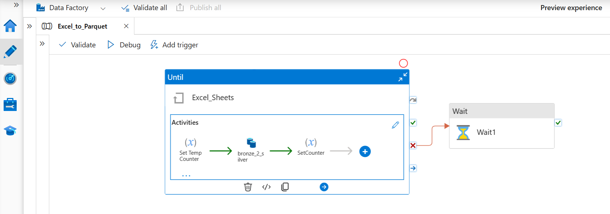
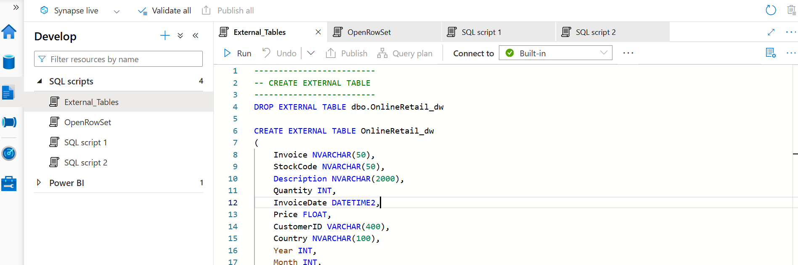

# Azure Medallion Lakehouse — Online Retail (ADF → Databricks → Synapse)

End-to-end Azure data engineering project using **Azure Data Factory** to land Excel → CSV in **ADLS Gen2** (Bronze), **Databricks** to transform into Delta (Silver/Gold) following the **Medallion** architecture, and **Synapse Serverless** external tables for ad‑hoc SQL and **Power BI**.


---

## 1) Project Structure

```
azure-online-retail-lakehouse/
├─ adf/
│  ├─ linkedServices/
│  ├─ datasets/
│  └─ pipelines/
├─ databricks/
│  ├─ 00_config.py
│  ├─ 01_bronze_ingest.py
│  ├─ 02_silver_transform.py
│  └─ 03_gold_analytics.py
├─ synapse/
│  └─ sql/
│     ├─ 01_external_objects.sql
│     └─ 02_external_tables.sql
├─ powerbi/
│  └─ OnlineRetail.pbids
├─ notebooks/  # optional: .ipynb copies for Silver/Gold
├─ assets/     # architecture & screenshots
├─ docs/
├─ .gitignore
├─ LICENSE
└─ README.md
```

> **Dataset**: UCI / Online Retail (Excel workbook). You can replace with any Excel containing multiple sheets (e.g., Orders, Products).

---

## 2) End-to-End Flow

1. **Land (ADF)**: Copy Excel **sheets → CSV** into ADLS Gen2 **bronze** path. A `ForEach`/`Until` (or `GetMetadata`) drives sheet iteration.  
2. **Transform (Databricks)**: Read bronze CSV, standardize schema, clean, add derived fields → write **Delta** to **silver**; aggregate/business marts → **gold**.  
3. **Serve (Synapse Serverless)**: Create **external data source** + **DELTA** file format and **external tables** over gold Delta for SQL access.  
4. **Visualize (Power BI)**: Connect to Synapse Serverless (`pbids` template included).

---

## 3) Paths & Naming

Set these once and keep consistent across ADF, Databricks, and Synapse:

- Storage account: `abfss://{container}@{account}.dfs.core.windows.net`
- Bronze: `abfss://{container}@{account}.dfs.core.windows.net/bronze/`
- Silver: `.../silver/`
- Gold:   `.../gold/`

---

## 4) Deploy

### A) Data Factory

- Import the template in `adf/pipelines/Excel_to_CSV_ExcelSheets.template.json` (uses `GetMetadata` + `ForEach` + `Copy`).  
- Create/parameterize linked services for **AzureBlobFS (ADLS Gen2)** and source **HTTP/LocalFile/Blob** as needed.  
- Datasets in `adf/datasets/*` are minimal examples—adjust schemas & parameters.



### B) Databricks

- Create a **Cluster** (DBR 13.x+).  
- Import the `databricks/*.py` as notebooks (or use **Repos**).  
- Run in order: `00_config` → `01_bronze_ingest` → `02_silver_transform` → `03_gold_analytics`.

### C) Synapse Serverless

- Open **Develop → SQL scripts**.  
- Execute `synapse/sql/01_external_objects.sql` then `02_external_tables.sql`.  
- Adjust storage account, container, and file paths to your **gold** Delta tables.



### D) Power BI

- Double‑click `powerbi/OnlineRetail.pbids` → choose your **serverless endpoint** and database.

---

## 5) Notes

- The ADF template emits **CSV** per Excel sheet (robust when Excel → Parquet fails on mixed schemas).  
- Databricks writes **Delta** with schema enforcement, partitioning (by `year`, `month`) to optimize Synapse queries.  
- Synapse serverless supports querying **Delta** in ADLS Gen2 without a dedicated pool.

---

## 6) Credits

- Architecture & screenshots captured during build. Replace with your own secrets/IDs before publishing.

Enjoy! ✨
